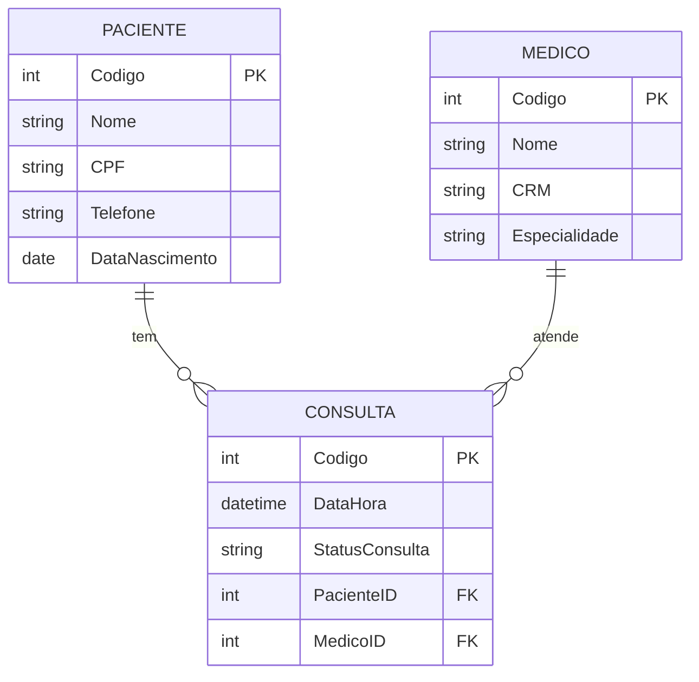

# appReversoTask

Agenda de consultas da **Clínica Vida & Saúde**. O paciente entra apenas com o CPF e acompanha as próprias consultas. Projeto em ASP.NET Core MVC com Entity Framework Core, com modelo gerado a partir de um banco existente (engenharia reversa).


## Sumário

- [Funcionalidades](#funcionalidades)
- [Tecnologias](#tecnologias)
- [Modelo de dados](#modelo-de-dados)
- [Rotas](#rotas)
- [Como o login funciona](#como-o-login-funciona)
- [Como rodar](#como-rodar)
- [Estrutura do projeto](#estrutura-do-projeto)
- [Pontos de atenção](#pontos-de-atenção)

## Funcionalidades

- Cadastro de **pacientes**, **médicos** e **consultas** (CRUD completo de cada um).
- Login do paciente somente com o **CPF**, usando cookie de autenticação (expira em 30 minutos).
- Tela de consultas que mostra **somente as consultas do paciente logado**.
- Cadastro de novo paciente pelo link "Cadastre-se aqui" na tela de login.
- Barra superior com "Olá, {nome}" e botão **Sair** quando há login.

## Tecnologias

| Item | Detalhe |
| --- | --- |
| Plataforma | .NET 8 (`net8.0`), ASP.NET Core MVC |
| Acesso a dados | Entity Framework Core 8.0.31 (SQL Server) |
| Autenticação | Cookie (`CookieAuthenticationDefaults`), login em `/Account/Login` |
| Front-end | Razor Views, Bootstrap, jQuery e jQuery Validation |
| Banco | SQL Server, banco `dbClinicaBM` |

## Modelo de dados



| Tabela | Campo | Tipo no banco | Observação |
| --- | --- | --- | --- |
| Paciente | Nome | varchar(100) | |
| Paciente | CPF | varchar(14) | Formato `000.000.000-00` |
| Paciente | Telefone | varchar(20) | |
| Paciente | DataNascimento | date | `DateOnly` no C# |
| Medico | Nome | varchar(100) | |
| Medico | CRM | varchar(50) | |
| Medico | Especialidade | varchar(100) | |
| Consulta | DataHora | datetime | |
| Consulta | StatusConsulta | varchar(50) | Texto livre, sem lista de valores |
| Consulta | PacienteID / MedicoID | int | Chaves `FK_Consulta_Paciente` e `FK_Consulta_Medico` |

## Rotas

Todos os controllers seguem o padrão do scaffold: `Index`, `Details/{id}`, `Create`, `Edit/{id}` e `Delete/{id}`.

| Controller | Rota base | Exige login? | Observação |
| --- | --- | --- | --- |
| `AccountController` | `/Account` | Não | `Login` (GET/POST) e `Logout` |
| `ConsultaController` | `/Consulta` | **Sim** (`[Authorize]`) | `Index` filtra pelo paciente logado |
| `PacienteController` | `/Paciente` | Não | O `Create` é o cadastro inicial |
| `MedicoController` | `/Medico` | Não | |
| `HomeController` | `/` | Não | Home, Privacy e Error |

## Como o login funciona

1. O paciente digita o CPF em `/Account/Login`.
2. O `LoginViewModel` exige o campo. Vazio, mostra "O CPF é obrigatório.".
3. O sistema procura o paciente com `Cpf == valor digitado`. Se não achar: "CPF não encontrado. Faça seu cadastro primeiro."
4. Se achar, cria as claims `NameIdentifier` (Codigo), `Name` e `CPF` e grava o cookie.
5. Redireciona para `/Consulta`, cujo `Index` lê o `Codigo` da claim e devolve só as consultas daquele paciente.

Não há senha e não há Session: a identidade vive apenas no cookie. A comparação do CPF é exata, então `12345678901` **não** encontra `123.456.789-01`.

## Como rodar

### Pré-requisitos

- [.NET 8 SDK](https://dotnet.microsoft.com/download/dotnet/8.0)
- SQL Server acessível (a configuração padrão aponta para a instância `.\SENAI`)

### 1. Criar o banco

O repositório não traz o script de criação. O DDL abaixo foi reconstruído a partir do `DbClinicaBmContext`; ajuste se o seu banco original for diferente.

```sql
CREATE DATABASE dbClinicaBM;
GO
USE dbClinicaBM;

CREATE TABLE Paciente (
  Codigo INT IDENTITY(1,1) PRIMARY KEY,
  Nome VARCHAR(100) NOT NULL,
  CPF VARCHAR(14) NOT NULL,
  Telefone VARCHAR(20) NOT NULL,
  DataNascimento DATE NOT NULL
);

CREATE TABLE Medico (
  Codigo INT IDENTITY(1,1) PRIMARY KEY,
  Nome VARCHAR(100) NOT NULL,
  CRM VARCHAR(50) NOT NULL,
  Especialidade VARCHAR(100) NOT NULL
);

CREATE TABLE Consulta (
  Codigo INT IDENTITY(1,1) PRIMARY KEY,
  DataHora DATETIME NOT NULL,
  StatusConsulta VARCHAR(50) NOT NULL,
  PacienteID INT NOT NULL CONSTRAINT FK_Consulta_Paciente REFERENCES Paciente(Codigo),
  MedicoID INT NOT NULL CONSTRAINT FK_Consulta_Medico REFERENCES Medico(Codigo)
);
```

### 2. Importar os pacientes de exemplo

O arquivo `Paciente.csv` traz 5 pacientes (`Nome`, `Cpf`, `Telefone`, `DataNascimento`). No SSMS, use **Tasks → Import Flat File** e importe só essas quatro colunas (o `Codigo` é gerado pelo banco). Confira com:

```sql
select * from paciente
```

### 3. Configurar a connection string

Defina a chave `ConexaoSqlServer` **sem gravar senha no repositório**. Exemplo com variável de ambiente (PowerShell):

```powershell
$env:ConnectionStrings__ConexaoSqlServer = "Server=.\SENAI;Database=dbClinicaBM;User Id=<usuario>;Password=<senha>;TrustServerCertificate=True;"
```

Ou, em desenvolvimento, com user-secrets:

```bash
cd appReversoTask
dotnet user-secrets init
dotnet user-secrets set "ConnectionStrings:ConexaoSqlServer" "Server=.\SENAI;Database=dbClinicaBM;User Id=<usuario>;Password=<senha>;TrustServerCertificate=True;"
```

### 4. Executar

```bash
cd appReversoTask
dotnet restore
dotnet run --project appReversoTask --launch-profile http
```

Acesse `http://localhost:5254` e entre com um CPF do CSV, por exemplo `123.456.789-01`. Depois cadastre médicos em `/Medico` e crie a primeira consulta em `/Consulta/Create`.

## Estrutura do projeto

```text
appReversoTask/
├── appReversoTask.sln
├── Paciente.csv                    # 5 pacientes de exemplo
├── SQLQuery1.sql                   # apenas: select * from paciente
└── appReversoTask/
    ├── Program.cs                  # DbContext, cookie (30 min) e rota padrão
    ├── appsettings.json            # connection string ConexaoSqlServer
    ├── Controllers/                # Account, Consulta, Paciente, Medico, Home
    ├── Models/                     # entidades, DbClinicaBmContext e LoginViewModel
    ├── Views/                      # Index, Details, Create, Edit e Delete por entidade + Login
    ├── Properties/launchSettings.json
    └── wwwroot/                    # css, js e bibliotecas (Bootstrap, jQuery)
```

## Pontos de atenção

Achados da leitura do código, do mais grave ao menos grave.

**Alta**

- **Cadastros abertos.** Só o `ConsultaController` tem `[Authorize]`. Qualquer visitante abre `/Paciente` e vê nome, CPF, telefone e nascimento de todos, e pode editar ou excluir. Como o CPF é a única credencial, isso entrega o acesso de qualquer paciente.
- **Consultas de outros pacientes.** Só o `Index` filtra pelo paciente logado. `Details`, `Edit` e `Delete` buscam por `Codigo` sem conferir o dono, e `Create`/`Edit` aceitam qualquer `PacienteId` do formulário.
- **Credenciais no `appsettings.json`.** A connection string usa o usuário `sa` com senha em texto puro. Troque a senha, mova a configuração para variável de ambiente ou user-secrets e deixe no repositório só um arquivo de exemplo.

**Média**

- **Login sem senha.** Quem souber um CPF entra como o paciente. Vale adicionar um segundo fator e normalizar o CPF (só dígitos).
- **Exclusão com consultas.** As chaves estrangeiras de `Consulta` são obrigatórias (`DeleteBehavior.ClientSetNull`). Apagar paciente ou médico que já tenha consultas viola a FK.
- **Formulários só com números.** As listas de Paciente e Médico mostram o `Codigo`, e o `Index` mostra o código do médico no lugar do nome.

**Baixa**

- Telas do scaffold ainda em inglês, `lang="en"` no layout e Home com o "Welcome" padrão.
- `AccountController` usa o namespace `appReverso.Controllers`, diferente do resto do projeto, e o `Index` antigo do `ConsultaController` ficou comentado.
- `Logout` é uma rota GET. Prefira POST com token antifalsificação.
- As pastas `bin/`, `obj/` e `.vs/` não devem ir para o Git. Crie um `.gitignore`.

**Pontos fortes:** o `Index` usa a claim do cookie (não um valor do formulário), o cookie expira em 30 minutos, e todas as ações POST têm `[ValidateAntiForgeryToken]` e `[Bind]` com lista explícita de campos.


## Desevolvido por João Victor Silva de Oliveira Melo
