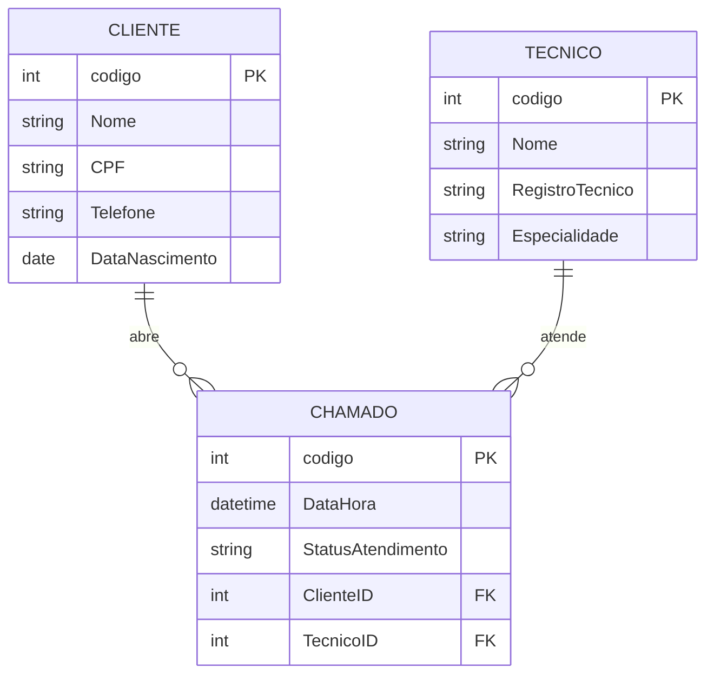

# appSatTech

Central de **suporte técnico**. O cliente entra com o CPF, abre chamados escolhendo o técnico e acompanha o status. Projeto em ASP.NET Core MVC com Entity Framework Core, cookie de autenticação e Session.


## Sumário

- [Funcionalidades](#funcionalidades)
- [Tecnologias](#tecnologias)
- [Modelo de dados](#modelo-de-dados)
- [Rotas](#rotas)
- [Como o login funciona](#como-o-login-funciona)
- [Como rodar](#como-rodar)
- [Estrutura do projeto](#estrutura-do-projeto)
- [Pontos de atenção](#pontos-de-atenção)

## Funcionalidades

- Cadastro de **clientes**, **técnicos** e **chamados** (CRUD completo de cada um).
- Login do cliente somente com o **CPF**, com cookie de autenticação e Session (30 minutos de inatividade).
- Lista "Meus chamados" com **somente os chamados do cliente logado**.
- Abertura de chamado com data e hora, status (Agendada, Realizada ou Cancelada) e técnico escolhido pelo nome. O cliente do chamado vem da Session, não do formulário.
- Interface própria em português: marca "ST", menu com Início, Clientes, Técnicos e Chamados, avatar com a inicial do nome e Home com atalhos.

## Tecnologias

| Item | Detalhe |
| --- | --- |
| Plataforma | .NET 8 (`net8.0`), ASP.NET Core MVC |
| Acesso a dados | Entity Framework Core 8.0.31 (SQL Server) |
| Autenticação | Cookie + Session (`IdleTimeout` de 30 min, `HttpOnly`) |
| Front-end | Razor Views, Bootstrap, jQuery e CSS próprio (azul `#2563eb`) |
| Banco | SQL Server, banco `dbTecnico` |

## Modelo de dados



| Tabela | Campo | Tipo no banco | Observação |
| --- | --- | --- | --- |
| Cliente | Nome | varchar(100) | |
| Cliente | CPF | varchar(20) | |
| Cliente | Telefone | varchar(20) | |
| Cliente | DataNascimento | date | `DateOnly` no C# |
| Tecnico | Nome | varchar(100) | |
| Tecnico | RegistroTecnico | varchar(50) | Ex.: `TEC/SP 123456` |
| Tecnico | Especialidade | varchar(50) | Ex.: Redes de Computadores |
| Chamado | DataHora | datetime | |
| Chamado | StatusAtendimento | varchar(50) | Agendada, Realizada ou Cancelada (lista no formulário) |
| Chamado | ClienteID / TecnicoID | int | Chaves `FK_Chamado_Cliente` e `FK_Chamado_Tecnico` |

## Rotas

Todos os controllers seguem o padrão do scaffold: `Index`, `Details/{id}`, `Create`, `Edit/{id}` e `Delete/{id}`.

| Controller | Rota base | Exige login? | Observação |
| --- | --- | --- | --- |
| `AccountController` | `/Account` | Não | `Login` (GET/POST) e `Logout` |
| `ChamadoController` | `/Chamado` | Parcial | Sem `[Authorize]`. `Index` e `Create` conferem a identidade à mão |
| `ClienteController` | `/Cliente` | Não | O `Create` é o "Criar minha conta" do login |
| `TecnicoController` | `/Tecnico` | Não | |
| `HomeController` | `/` | Não | Home, Privacy e Error |

## Como o login funciona

1. O cliente digita o CPF em `/Account/Login`. Vazio, mostra "O CPF é obrigatório.".
2. O sistema procura o cliente com `Cpf == valor digitado`. Se não achar: "CPF não encontrado. Faça seu cadastro primeiro."
3. Se achar, cria as claims `NameIdentifier` (Codigo), `Name` e `CPF` e grava o cookie.
4. Grava também `ClienteId` na **Session** (`Session.SetInt32("ClienteId", ...)`).
5. Redireciona para `/Chamado`.
6. O `Index` lê a **claim** para listar os chamados do cliente.
7. O `Create` lê a **Session** para definir o cliente do novo chamado. Sem Session, volta ao login.
8. O `Logout` limpa a Session e depois apaga o cookie.

A identidade está em dois lugares, e cada ação lê de um. Depois de 30 minutos parado, o cliente ainda aparece logado e vê a lista, mas é enviado ao login ao abrir um chamado. A comparação do CPF é exata: sem pontos e traço, o cadastro não é encontrado.

## Como rodar

### Pré-requisitos

- [.NET 8 SDK](https://dotnet.microsoft.com/download/dotnet/8.0)
- SQL Server acessível (a configuração padrão aponta para a instância `.\SENAI`)

### 1. Criar o banco

O repositório traz só os dados de teste, sem o script de criação. O DDL abaixo foi reconstruído a partir do `DbTecnicoContext`; ajuste se o seu banco original for diferente.

```sql
CREATE DATABASE dbTecnico;
GO
USE dbTecnico;

CREATE TABLE Cliente (
  codigo INT IDENTITY(1,1) PRIMARY KEY,
  Nome VARCHAR(100) NOT NULL,
  CPF VARCHAR(20) NOT NULL,
  Telefone VARCHAR(20) NOT NULL,
  DataNascimento DATE NOT NULL
);

CREATE TABLE Tecnico (
  codigo INT IDENTITY(1,1) PRIMARY KEY,
  Nome VARCHAR(100) NOT NULL,
  RegistroTecnico VARCHAR(50) NOT NULL,
  Especialidade VARCHAR(50) NOT NULL
);

CREATE TABLE Chamado (
  codigo INT IDENTITY(1,1) PRIMARY KEY,
  DataHora DATETIME NOT NULL,
  StatusAtendimento VARCHAR(50) NOT NULL,
  ClienteID INT NOT NULL CONSTRAINT FK_Chamado_Cliente REFERENCES Cliente(codigo),
  TecnicoID INT NOT NULL CONSTRAINT FK_Chamado_Tecnico REFERENCES Tecnico(codigo)
);
```

### 2. Carregar os dados de teste

Abra o `SQLQuery_dbTecnico.sql` no SSMS **com o banco `dbTecnico` selecionado**. O `use dbTecnico` está só no fim do arquivo, depois dos `INSERT`, então sem esse cuidado os inserts rodam no banco errado. O arquivo está em Latin-1: se "João" e "Manutenção" aparecerem quebrados, reabra com a codificação Windows-1252.

Dados incluídos:

| Cliente | CPF |
| --- | --- |
| Maria Oliveira | `111.222.333-44` |
| João Souza | `555.666.777-88` |

Também vêm 2 técnicos (Dra. Helena Rios, Dr. Roberto Alves) e 2 chamados agendados para 15 e 16/10/2026.

### 3. Configurar a connection string

Defina a chave `ConexaoSqlServer` **sem gravar senha no repositório**. Exemplo com variável de ambiente (PowerShell):

```powershell
$env:ConnectionStrings__ConexaoSqlServer = "Server=.\SENAI;Database=dbTecnico;User Id=<usuario>;Password=<senha>;TrustServerCertificate=True;"
```

Ou, em desenvolvimento, com user-secrets:

```bash
cd appSatTech
dotnet user-secrets init
dotnet user-secrets set "ConnectionStrings:ConexaoSqlServer" "Server=.\SENAI;Database=dbTecnico;User Id=<usuario>;Password=<senha>;TrustServerCertificate=True;"
```

### 4. Executar

```bash
cd appSatTech
dotnet restore
dotnet run --project appSatTech --launch-profile http
```

Acesse `http://localhost:5205` e entre com `111.222.333-44` (Maria) ou `555.666.777-88` (João), escritos com pontos e traço. Cada um vê só o próprio chamado.

## Estrutura do projeto

```text
appSatTech/
├── appSatTech.sln
├── SQLQuery_dbTecnico.sql          # dados de teste (Latin-1)
└── appSatTech/
    ├── Program.cs                  # DbContext, cookie, Session (30 min) e rota padrão
    ├── appsettings.json            # connection string ConexaoSqlServer
    ├── Controllers/                # Account, Chamado, Cliente, Tecnico, Home
    ├── Models/                     # entidades, DbTecnicoContext e LoginViewModel
    ├── Views/                      # Index, Details, Create, Edit e Delete por entidade + Login e Home
    ├── Properties/launchSettings.json
    └── wwwroot/                    # css próprio, js e bibliotecas (Bootstrap, jQuery)
```

## Pontos de atenção

Achados da leitura do código, do mais grave ao menos grave.

**Alta**

- **Nenhum controller exige login.** Só `Chamado/Index` e `Chamado/Create` conferem a identidade manualmente. Qualquer visitante abre `/Cliente` (CPF, telefone e nascimento de todos), `/Tecnico` e `/Chamado/Details/1`, e pode editar ou excluir sem entrar.
- **Chamados de outros clientes.** O `Edit` aceita `ClienteId` no `[Bind]` e nenhuma ação por id confere o dono. Basta trocar o id na URL para alterar ou apagar o chamado de outra pessoa.
- **Credenciais no `appsettings.json`.** A connection string usa o usuário `sa` com senha em texto puro. Troque a senha, mova a configuração para variável de ambiente ou user-secrets e deixe no repositório só um arquivo de exemplo.

**Média**

- **Cookie e Session com tempos diferentes.** Veja [Como o login funciona](#como-o-login-funciona). Use uma fonte só, lendo sempre a claim, ou defina o mesmo `ExpireTimeSpan` no cookie.
- **Login sem senha.** Quem souber um CPF entra como o cliente. Vale adicionar um segundo fator e normalizar o CPF (só dígitos).
- **Namespace de outro projeto.** O `ChamadoController` usa `appReversotask.Controllers`. Renomeie para `appSatTech.Controllers`.
- **Números no lugar de nomes.** O `Edit` volta a listar só o `Codigo`, e o `Index` de chamados mostra o código do cliente e do técnico.

**Baixa**

- O `GET /Chamado/Create` carrega a lista de clientes sem usá-la (o cliente vem da Session).
- O script SQL está em Latin-1, o `use` vem depois dos `INSERT` e não há `CREATE TABLE`.
- As pastas `bin/`, `obj/` e `.vs/` não devem ir para o Git. Crie um `.gitignore`.

**Pontos fortes:** o cliente do chamado vem da Session e não do formulário, o status é uma lista fechada, o layout está em pt-BR com identidade visual, e o código tem comentários explicando cada bloco.


**Desenvolvido por João Victor Silva de Oliveira Melo**
